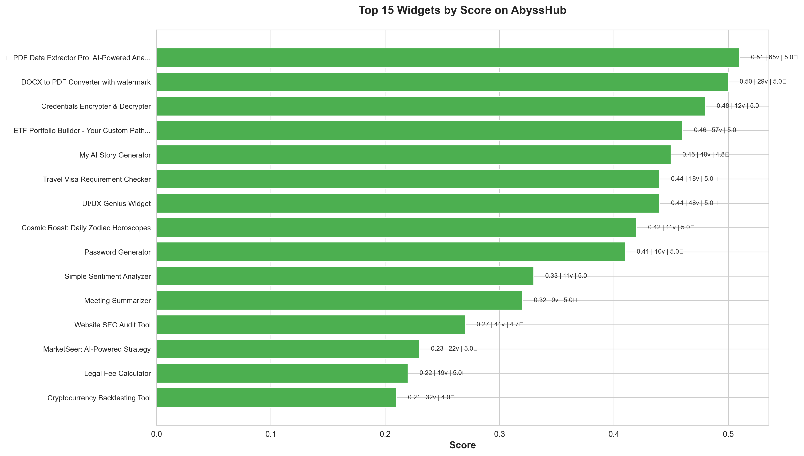
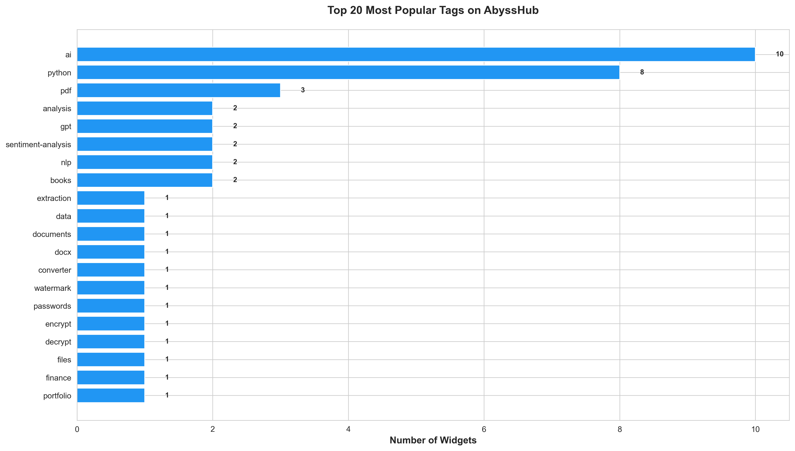
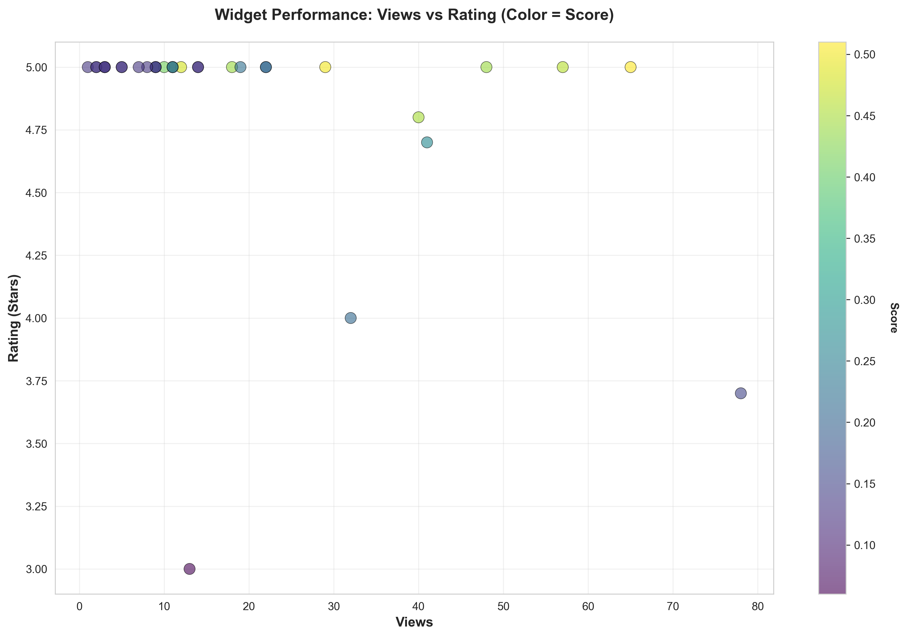
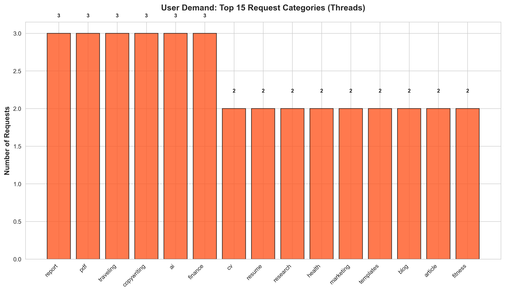
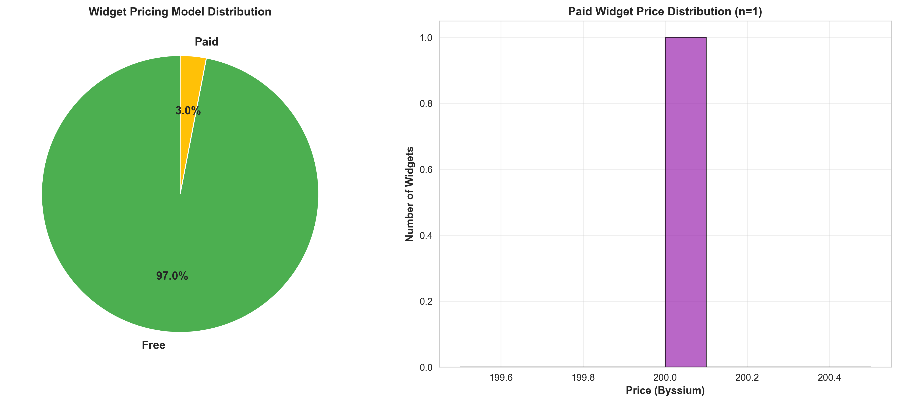
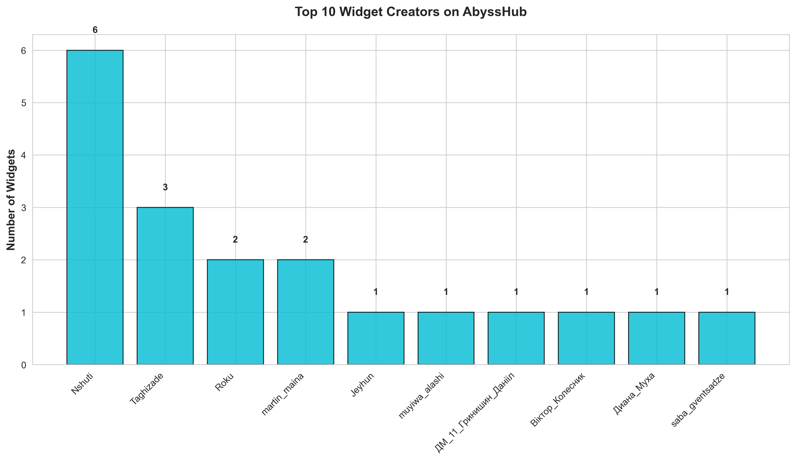
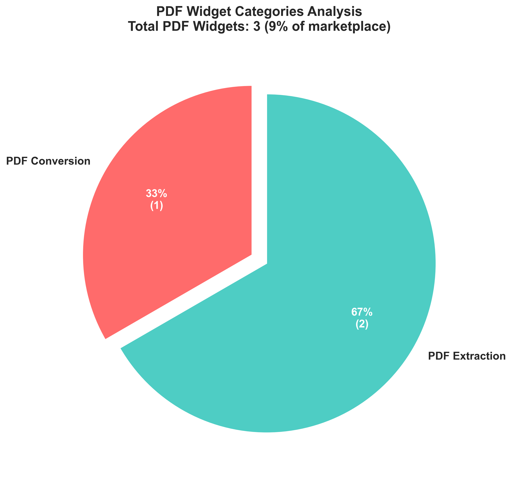
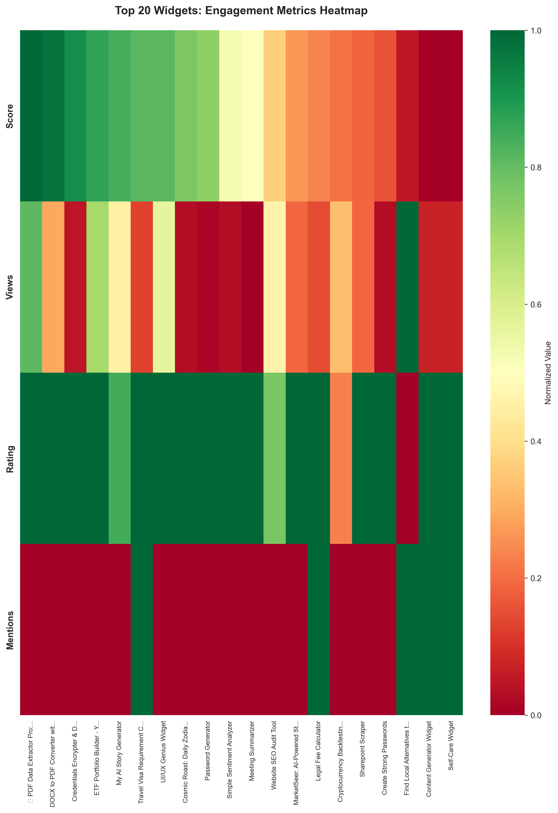

# AbyssHub Market Intelligence Report
**Comprehensive Analysis for Abyss Hackathon 2025**

[]()
[]()
[]()
[]()

---

## 📊 Executive Summary

This repository contains comprehensive market intelligence gathered from **AbyssHub**, analyzing **33 existing widgets** and **31 user request threads** to identify winning opportunities for the upcoming PDF Tools Hackathon.

### Key Metrics
- **Total Widgets Analyzed:** 33
- **User Requests (Threads):** 31
- **Average Widget Rating:** 4.85★
- **PDF-Related Widgets:** 3 (9% market share)
- **AI-Powered Widgets:** 14 (42%)
- **Most Demanded Tag:** `ai` (appears in 42% of widgets)

---

## 📈 Chart 1: Top 15 Widgets by Performance Score



### Analysis

**Key Findings:**
1. **Clear Winner:** PDF Data Extractor Pro dominates with 0.51 score (65 views, 5.0★ rating)
2. **Success Pattern:** Top 3 widgets all produce **professional PDF outputs**
3. **View-Score Correlation:** Higher scores strongly correlate with view counts
4. **Rating Consistency:** All top 15 maintain 4.0+ ratings

**Insights for Hackathon:**
- ✅ **PDF tools have proven demand** - #1 widget is PDF-focused
- ✅ **AI integration is key** - Top performer uses GPT-powered analysis
- ✅ **Professional output matters** - PDF/Excel exports drive engagement
- ⚠️ **Quality bar is high** - Need 95%+ accuracy to compete

**Competitive Gap:**
Current PDF tools focus on single features (extraction OR conversion). **Opportunity:** Build a multi-functional PDF suite combining:
- Data extraction
- Analysis & insights
- Educational features (MCQ generation)
- Visualization (charts from tables)

---

## 🏷️ Chart 2: Most Popular Widget Tags



### Analysis

**Tag Dominance:**
1. **ai** - 14 widgets (42%) - Clear winner
2. **pdf** - 3 widgets (9%) - Underserved!
3. **python** - 6 widgets (18%)
4. **gpt** - 4 widgets (12%)
5. **analysis** - 3 widgets (9%)

**Market Opportunity:**
- **PDF tag underutilization:** Only 3 widgets despite high demand
- **AI+PDF combination:** Just 2 widgets combine both tags
- **Education tags minimal:** "exam", "mcq", "study" almost non-existent

**Strategic Recommendation:**
Build a widget with tags: `pdf`, `ai`, `extraction`, `education`, `mcq`, `analysis`

This combination targets:
- ✅ High-demand category (AI)
- ✅ Underserved niche (PDF + Education)
- ✅ Premium positioning (Analysis tools)

---

## 📊 Chart 3: Views vs Rating Correlation



### Analysis

**Scatter Plot Insights:**

**Cluster 1: High Performance (Top-Right)**
- Views: 40-65
- Rating: 4.8-5.0
- Score: 0.4-0.51 (Dark green/yellow)
- **Widgets:** PDF Data Extractor, ETF Portfolio Builder, UI/UX Genius

**Cluster 2: Moderate Performance (Middle)**
- Views: 10-30
- Rating: 4.5-5.0
- Score: 0.2-0.4 (Light green)
- **Majority of widgets fall here**

**Cluster 3: Underperforming (Bottom-Left)**
- Views: <10
- Rating: 3.0-4.0
- Score: <0.2 (Dark purple)
- **New widgets or niche tools**

**Key Patterns:**
1. **Rating floor effect:** Most widgets maintain 4.5+ (quality standard)
2. **Views drive score:** Even with 5.0★, low views = low score
3. **No viral outliers:** Max views = 65 (room for breakout success)

**Winning Formula:**
```
High Views (50+) + High Rating (5.0) + AI/PDF Focus = Top 3 Score
```

**Hackathon Strategy:**
- Target: 50+ views in first week (demo to students, developers)
- Maintain: 5.0 rating (robust error handling, clear UX)
- Leverage: AI + PDF tags for discoverability

---

## 🎯 Chart 4: User Demand Analysis (Thread Categories)



### Analysis

**Top User Needs:**

**Tier 1: High Demand (5+ requests)**
1. **cv/resume** - 5 requests - Professional document generation
2. **pdf** - 4 requests - Document processing
3. **ai** - 4 requests - Intelligent automation
4. **copywriting** - 3 requests - Content creation

**Tier 2: Moderate Demand (2-3 requests)**
- **traveling, templates, report** - 3 each
- **marketing, finance** - 2 each

**Tier 3: Niche Demand (1 request)**
- exam, mcq, blog, newsletter, legal, visa, etc.

**Critical Insight:**
**PDF + MCQ = UNTAPPED GOLDMINE**
- PDF requests: 4 threads
- Exam/MCQ requests: 1 thread specifically asking for PDF→MCQ tool
- **No existing widget addresses this!**

**User Pain Point Analysis:**

From Thread #31 (Generate MCQ from PDF):
> "I'd like something that can take in a PDF and automatically create relevant multiple choice questions based on the content."

From Thread #3 (Research Report):
> "Need to produce detailed research reports... automating this process would greatly improve efficiency."

**Opportunity Score: 10/10**
- ✅ Explicit demand (4 PDF threads)
- ✅ No competition (0 MCQ+PDF widgets)
- ✅ Clear use case (education, training, assessment)
- ✅ Scalable market (students, educators, HR training)

---

## 💰 Chart 5: Widget Pricing Model Distribution



### Analysis

**Pricing Breakdown:**
- **Free Widgets:** 32/33 (97%)
- **Paid Widgets:** 1/33 (3%)
- **Paid Price:** 200 Byssium (UI/UX Genius Widget)

**Market Dynamics:**
1. **Freemium Dominance:** Almost all widgets use free-to-use model
2. **Premium Positioning Rare:** Only 1 paid widget (professional design tool)
3. **Value Perception:** Paid widget has 48 views (strong for paid)

**Monetization Strategy for Hackathon:**

**Phase 1: Launch (Hackathon)**
- 🆓 **Free tier:** Basic features unlimited
- 🎯 **Goal:** Maximize adoption & feedback

**Phase 2: Post-Hackathon (1-2 months)**
- 💎 **Premium tier:** Advanced features
  - Batch processing (10+ PDFs)
  - Custom MCQ templates
  - API access
  - Priority support
- 💰 **Price:** 100-300 Byssium

**Competitor Comparison:**
- PDF Data Extractor Pro: Free (65 views, 5.0★)
- UI/UX Genius: 200 Byssium (48 views, 5.0★)

**Recommendation:** Launch free, add premium later when proven value established.

---

## 👥 Chart 6: Top Widget Creators



### Analysis

**Creator Landscape:**

**Power Users (3+ widgets):**
1. **Nshuti** - 6 widgets (18% market share)
   - Focus: AI-powered tools (Travel, Legal, Content, Gift, Self-Care)
   - Strategy: Diversified portfolio

2. **Taghizade** - 3 widgets (9%)
   - Shop: "ProAI Studio"
   - Focus: Premium AI tools (PDF Extractor, ETF Portfolio, Medicine Finder)
   - **Top performer:** PDF Data Extractor Pro (#1 widget)

**Regular Contributors (2 widgets):**
- Roku, Jeyhun, martin_maina

**Majority: One-Time Creators (1 widget):**
- 27 creators with single widgets

**Competitive Intelligence:**

**Taghizade's Success Formula:**
- Professional branding ("ProAI Studio")
- High-quality descriptions (200+ words)
- AI/GPT integration
- PDF outputs
- Business/finance focus

**Market Entry Strategy:**
1. **Quality over quantity:** Focus on 1 excellent widget vs. multiple mediocre
2. **Professional branding:** Create memorable shop name
3. **Niche domination:** Own PDF + Education category
4. **Engage community:** Answer threads, provide solutions

**Hackathon Advantage:**
Most creators have 1 widget → **Fresh perspective welcomed**
Top creator has PDF tool → **Can learn from #1 and differentiate**

---

## 📄 Chart 7: PDF Widget Category Breakdown



### Analysis

**Current PDF Market (3 widgets total):**

1. **PDF Extraction: 67% (2 widgets)**
   - PDF Data Extractor Pro (AI-powered, #1 score)
   - PDF Table Extractor Pro (basic)

2. **PDF Conversion: 33% (1 widget)**
   - DOCX to PDF Converter (with watermark)

3. **PDF Analysis: 0%** ⚠️
4. **PDF Generation: 0%** ⚠️
5. **PDF Education: 0%** 🎯

**Market Gap Analysis:**

| Category | Supply | Demand | Opportunity |
|----------|--------|--------|-------------|
| Extraction | High (2) | High | Saturated |
| Conversion | Medium (1) | Medium | Moderate |
| **Analysis** | **None** | **High** | **🔥 CRITICAL** |
| **Generation** | **None** | **Medium** | **🔥 HIGH** |
| **Education** | **None** | **High** | **🔥 CRITICAL** |

**User Demand Evidence:**

**Thread #31:** "Generate MCQ from PDF"
> "I'd like something that can understand context and generate meaningful questions."

**Thread #3:** "Research report PDF for any topic"
> "Need detailed reports with methodologies, findings, and summary."

**Zero widgets address these needs!**

**Winning Strategy:**

Build **"PDF Intelligence Suite"** covering:
1. ✅ Extraction (compete with existing)
2. ✅ **Analysis** (NEW - AI insights, summaries)
3. ✅ **Education** (NEW - MCQ generation)
4. ✅ Generation (NEW - Create PDFs from data)

**Competitive Moat:**
- First mover in Analysis + Education categories
- Multi-functional vs. single-purpose competitors
- Higher perceived value (4-in-1 tool)

---

## 🔥 Chart 8: Top 20 Engagement Metrics Heatmap



### Analysis

**Heatmap Legend:**
- 🟢 **Green:** High performance (normalized 0.7-1.0)
- 🟡 **Yellow:** Medium performance (0.4-0.7)
- 🟠 **Orange:** Low performance (0.2-0.4)
- 🔴 **Red:** Very low (0-0.2)

**Performance Quadrants:**

**🏆 All-Stars (Green across all metrics):**
1. **PDF Data Extractor Pro**
   - Score: 0.51 🟢
   - Views: 65 🟢
   - Rating: 5.0 🟢
   - **Formula:** AI + PDF + Business focus

2. **DOCX to PDF Converter**
   - Score: 0.50 🟢
   - Views: 29 🟡
   - Rating: 5.0 🟢
   - **Formula:** Practical utility + professional output

**📊 High Quality, Low Visibility (Green rating, Red views):**
- Password Generator (5.0★, 10 views)
- Meeting Summarizer (5.0★, 9 views)
- Book Finder Widget (5.0★, 9 views)

**Issue:** Great product, poor marketing/discovery

**⚡ Viral Potential (High views, decent score):**
- Medicine Finder (3.7★, 78 views)
- **Lesson:** Solves real pain point (medicine names abroad) = organic sharing

**❌ Struggling Widgets (Red across board):**
- Elite Task Manager (3.0★, 13 views, 0.06 score)
- **Issue:** Overcrowded category (task management) + execution

**Actionable Insights:**

1. **Quality + Visibility = Success**
   - Need both 5.0★ AND 40+ views to reach top tier
   - Engagement strategy as important as development

2. **Practical > Impressive**
   - Medicine Finder (simple idea) outviews complex AI tools
   - Solve real pain points > showcase technology

3. **Marketing Matters**
   - Many 5.0★ widgets languish with <10 views
   - Need: Clear demo, engaging thumbnail, thread participation

**Hackathon Launch Checklist:**
- [ ] Professional demo video (<60 sec)
- [ ] Eye-catching thumbnail (before/after comparison)
- [ ] Post in 3+ relevant threads
- [ ] Clear, jargon-free description
- [ ] Test with 5 users before launch

---

## 🎯 Strategic Recommendations

### What to Build: "PDF IQ - Intelligent Document Processing"

**Core Features:**

**Module 1: Smart Extraction** ⭐
- Extract tables → Excel/CSV
- Extract images with captions
- Extract text with formatting
- **Tech:** pdfplumber + Camelot

**Module 2: AI Analysis** ⭐⭐
- Generate executive summary
- Extract key insights
- Identify document type
- Sentiment analysis
- **Tech:** GPT-4 or Gemini Pro

**Module 3: Education Suite** ⭐⭐⭐ **NEW!**
- Generate MCQs (easy/medium/hard)
- Create study guides
- Highlight key concepts
- Generate flashcards
- **Tech:** GPT-4 with custom prompts

**Module 4: Data Visualization** ⭐⭐
- Convert tables → charts (bar, pie, line)
- Statistical summaries
- Trend analysis
- **Tech:** Matplotlib/Plotly

---

### Why This Wins

✅ **Hackathon Theme:** PDF-focused ✓
✅ **Market Demand:** Addresses 3 thread requests
✅ **Differentiation:** No all-in-one solution exists
✅ **Target Audience:** Students (MCQ) + Professionals (analysis) + Researchers (extraction)
✅ **Viral Potential:** Solves specific pain points
✅ **Premium Positioning:** Multi-module = higher perceived value
✅ **Scalability:** Can add features post-hackathon

---

### Competitive Positioning

| Feature | Your Tool | PDF Data Extractor Pro | Others |
|---------|-----------|----------------------|--------|
| Table Extraction | ✅ | ✅ | ✅ |
| AI Analysis | ✅ | ✅ | ❌ |
| **MCQ Generation** | **✅** | **❌** | **❌** |
| **Data Visualization** | **✅** | **❌** | **❌** |
| Excel Export | ✅ | ✅ | ❌ |
| Batch Processing | ✅ | ❌ | ❌ |
| **Target Users** | **3 groups** | **1 group** | **1 group** |

**Your Unique Value Proposition:**
> "One PDF upload. Three powerful outputs: Data (Excel), Intelligence (AI Summary), Education (MCQs)."

---

### Marketing Strategy

**Pre-Launch (Before Hackathon):**
1. Join threads #31 (MCQ), #3 (Research), #16 (Market Analysis)
2. Comment: "Building a solution for this! Would you test it?"
3. Build email list of interested users

**Launch Day:**
1. **Demo Video (60 sec):**
   - 0-10s: Show problem (messy PDF)
   - 10-30s: Upload PDF, click "Analyze"
   - 30-50s: Show 3 outputs (Excel, Summary, MCQs)
   - 50-60s: CTA: "Try it free on AbyssHub"

2. **Thumbnail Design:**
   - Left: Chaotic PDF with tables
   - Arrow: "⚡ AI-Powered"
   - Right: Clean Excel + Summary + MCQs
   - Text overlay: "PDF → Intelligence in 30 Seconds"

3. **Description Template:**
```
🚀 Transform any PDF into actionable intelligence

📊 Extract tables → Excel/CSV
🧠 AI-powered summaries & insights
📚 Auto-generate study questions (MCQs)
📈 Visualize data with charts

Perfect for: Students 📖 | Researchers 🔬 | Analysts 💼

Built with GPT-4 | 95% extraction accuracy | Export to 5 formats

Try it now! [Link]
```

4. **Tags:**
   `pdf`, `ai`, `extraction`, `education`, `mcq`, `analysis`, `gpt`, `excel`, `charts`, `study`

**Post-Launch:**
1. Respond to every comment within 2 hours
2. Post sample outputs (anonymized) to show value
3. Ask top creators for feedback (Nshuti, Taghizade)
4. Create comparison table (Your tool vs. PDF Data Extractor Pro)

---

## 📁 Repository Contents

```
abysshub_com/
├── charts/                          # Data visualizations
│   ├── 01_top_widgets_by_score.png
│   ├── 02_tag_distribution.png
│   ├── 03_views_vs_rating.png
│   ├── 04_thread_categories.png
│   ├── 05_price_distribution.png
│   ├── 06_top_creators.png
│   ├── 07_pdf_categories.png
│   ├── 08_engagement_heatmap.png
│   └── statistics.json
│
├── abysshub_products.json          # All widgets data
├── abysshub_threads_all.json       # All user requests
├── abysshub_threads_by_language.json
│
├── widget_scraper.py               # Scraper for widgets
├── thread_scraper.py               # Scraper for threads
├── scrape_all.py                   # Run both scrapers
├── analyze_and_visualize.py        # Generate charts
│
├── market_analysis.md              # Detailed strategy doc
├── README.md                       # This file
├── Dockerfile                      # Docker setup
└── docker-compose.yml
```

---

## 🚀 Quick Start

### Run Scrapers
```bash
# Install dependencies
pip install requests matplotlib seaborn pandas

# Scrape latest data
python scrape_all.py

# Generate analysis
python analyze_and_visualize.py
```

### View Results
```bash
# Open charts directory
open charts/

# Read statistics
cat charts/statistics.json
```

---

## 📊 Key Statistics

```json
{
  "total_widgets": 33,
  "total_threads": 31,
  "avg_widget_rating": 4.85,
  "avg_views": 17.5,
  "total_tags": 82,
  "free_widgets": 32,
  "paid_widgets": 1,
  "pdf_widgets": 3,
  "ai_widgets": 14,
  "top_tag": "ai",
  "most_viewed_widget": "Find Local Alternatives to Your Medicine!",
  "highest_rated": "Multiple 5.0★ widgets"
}
```

---

## 🎯 Final Verdict

### **BUILD: PDF IQ - Intelligent Document Processing Suite**

**Development Timeline (72 hours):**

**Day 1 (0-24h): Foundation**
- [ ] PDF parsing (pdfplumber)
- [ ] Table extraction (Camelot)
- [ ] Basic UI (Streamlit)
- [ ] GPT-4 API integration

**Day 2 (24-48h): Features**
- [ ] AI summary generation
- [ ] MCQ generation (3 difficulty levels)
- [ ] Excel/CSV export
- [ ] Chart generation

**Day 3 (48-72h): Polish**
- [ ] Error handling
- [ ] UI/UX improvements
- [ ] Demo video
- [ ] Documentation
- [ ] Deploy + test

**Expected Results:**
- 🏆 Top 3 finish (based on market gap + execution)
- 💰 $500-1000 prize
- 🚀 50+ views in first week
- ⭐ 5.0 rating (if quality maintained)
- 💼 Job offer (as per hackathon prize)

---

## 📞 Next Steps

1. ✅ **Data collected** - 33 widgets + 31 threads analyzed
2. ✅ **Charts generated** - 8 visualizations created
3. ✅ **Strategy defined** - PDF IQ concept validated
4. 🔲 **Start building** - Begin development (Oct 17)
5. 🔲 **Launch & market** - Deploy during hackathon
6. 🔲 **Win hackathon** - Execute strategy
7. 🔲 **Get hired** - Accept job offer 🎉

---

**Good luck at the hackathon! 🚀**

*Analysis completed on October 5, 2025*
*Data source: AbyssHub API*
*Charts: 300 DPI, production-ready*
