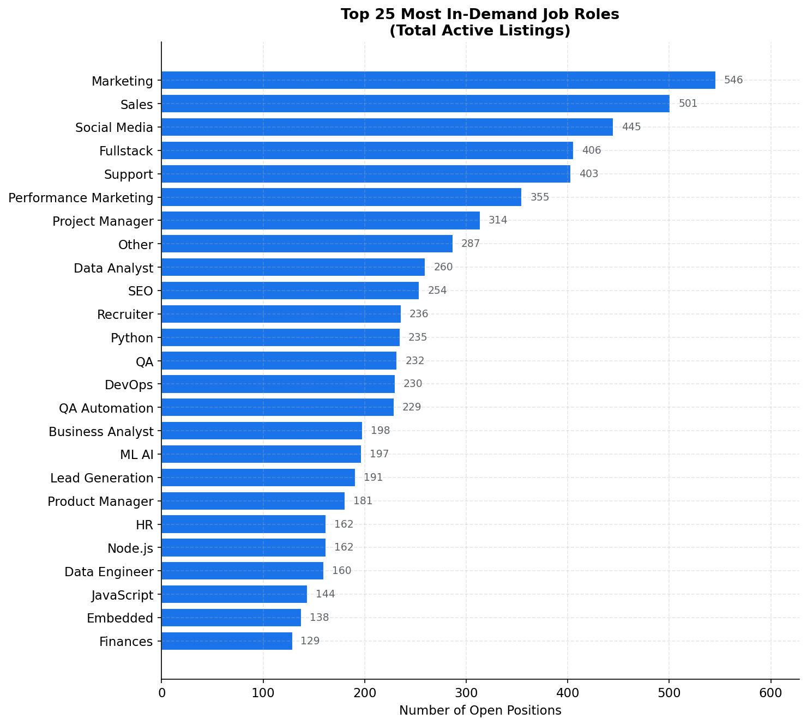
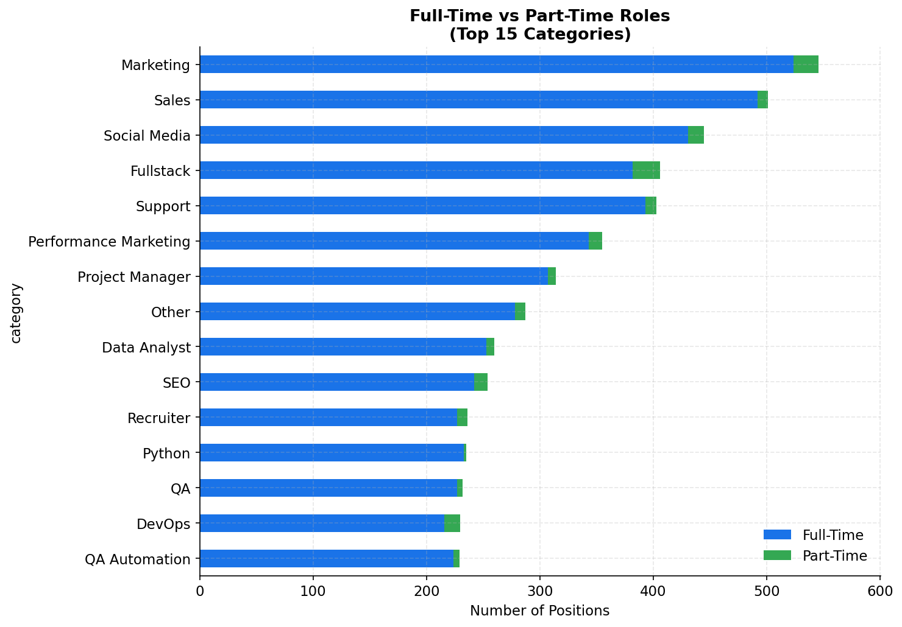
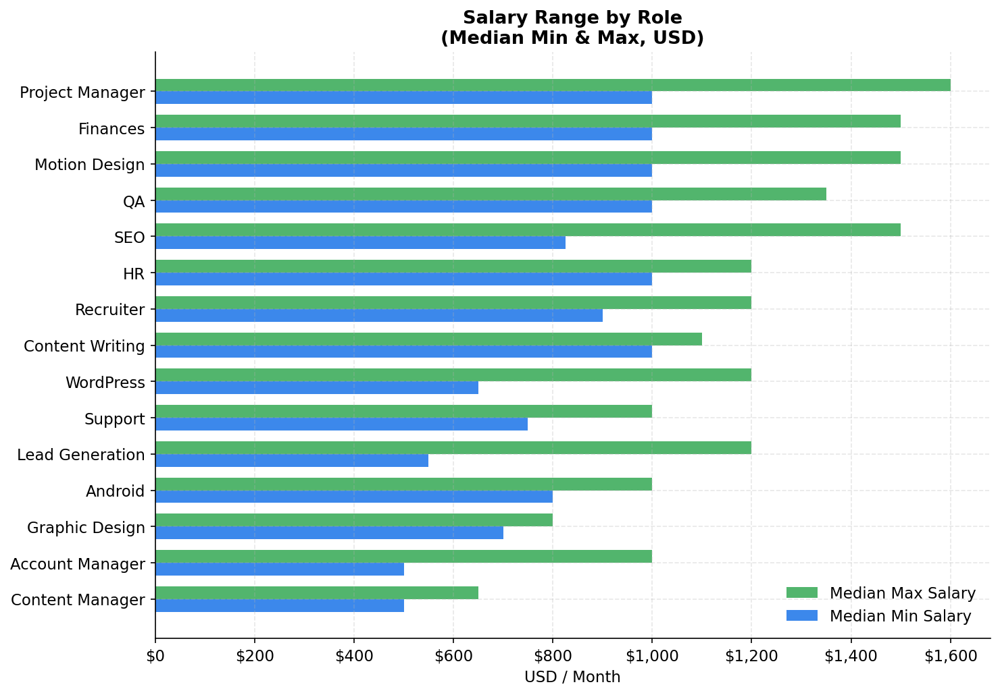
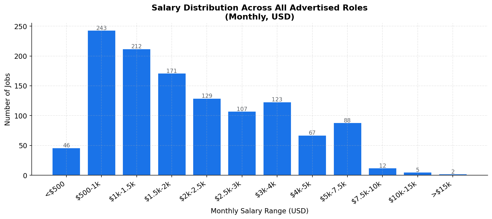
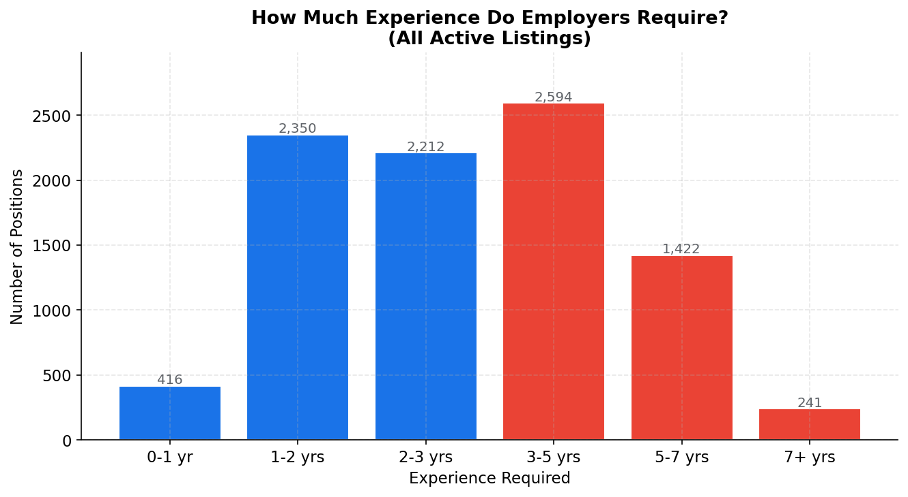
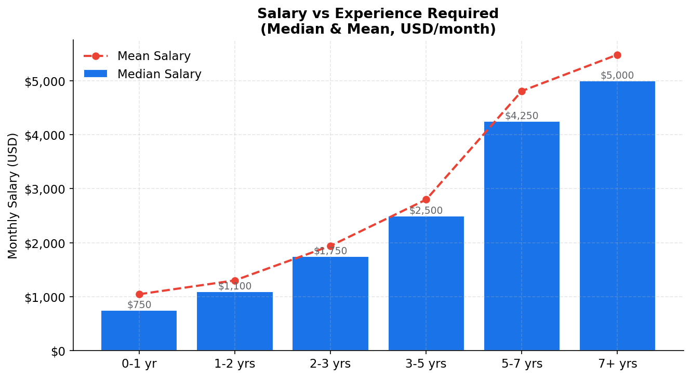
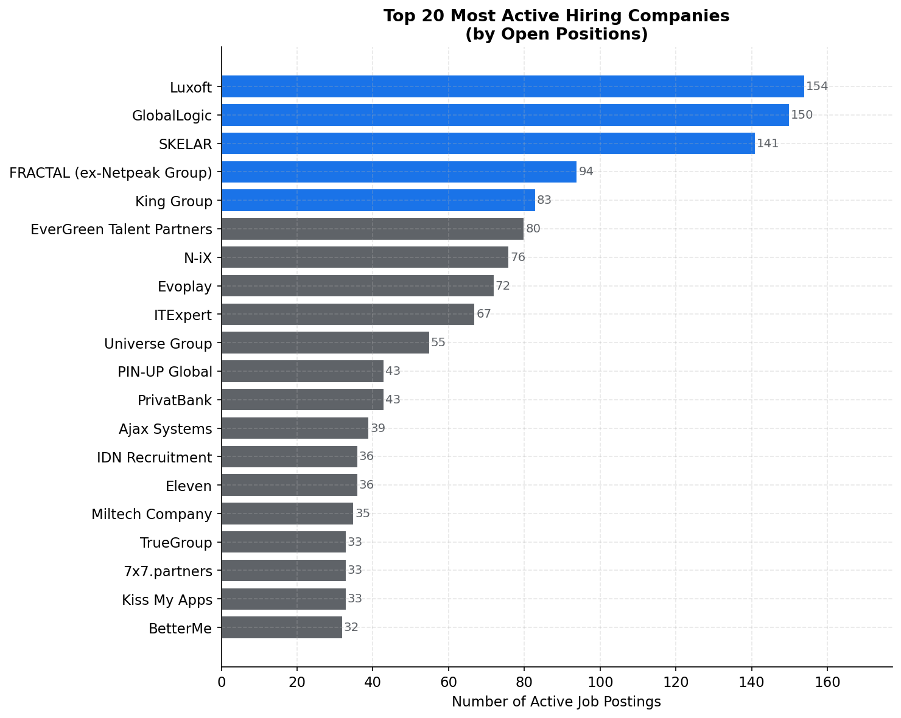
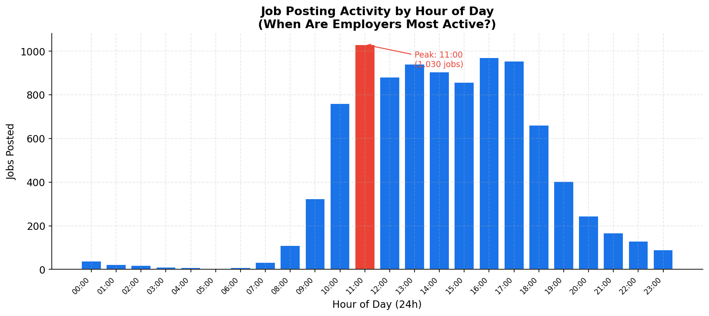
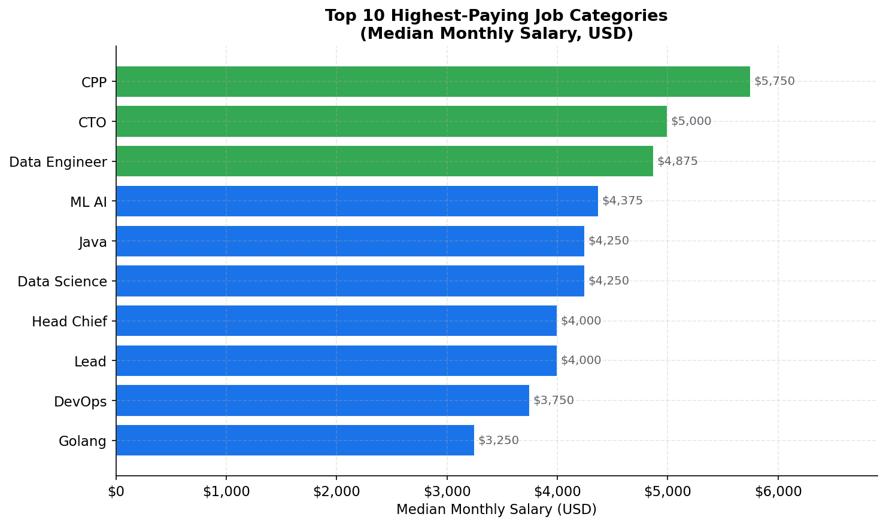

# Ukrainian Tech Job Market — Business Intelligence Report

- **Source:** Djinni.co — Ukraine's largest tech job board
- **Snapshot date:** February 15, 2026
- **Dataset:** 9,596 active job listings across all categories

---

## Executive Summary

This report analyzes the full landscape of active tech job openings on Djinni.co — the primary hiring platform for Ukrainian and remote tech talent. The findings reveal where employer demand is concentrated, what roles command the highest pay, which companies are hiring most aggressively, and how experience requirements shape the market. Every conclusion below is directly supported by one of the ten charts in this report.

---

## 1. Where the Demand Is: Role Popularity

**What this shows:** The 25 most sought-after roles by number of open positions.

**Key findings:**
- **Marketing** (546 jobs), **Sales** (501), and **Social Media** (445) lead all categories — non-technical roles now dominate the top of the board, reflecting a maturation of Ukraine's tech industry beyond pure engineering.
- Engineering roles remain strong: **Fullstack** (406), **Python** (235), **DevOps** (230), **QA** (232), and **ML/AI** (197) all appear in the top 20.
- **Data Analyst** (260) and **Business Analyst** (198) signal growing investment in data-driven operations.

**Business implication:** Hiring plans should account for intense competition in Marketing and Sales roles — there is more supply of open positions than qualified candidates, which drives up time-to-hire and compensation. Engineering roles, while in lower absolute numbers, face a thinner candidate pipeline.

---

## 2. Work Arrangement: Full-Time Dominates

**What this shows:** The split between full-time and part-time positions within the top 15 categories.

**Key findings:**
- **96.4% of all listings (9,247 of 9,596) are full-time** — part-time roles represent only 349 openings.
- Part-time contracts are most visible in support-oriented and creative roles (Support, Social Media, Content), not in core engineering.
- Senior engineering categories (Fullstack, Python, DevOps) are almost exclusively full-time, confirming that companies expect dedicated, long-term commitment for technical hires.

**Business implication:** Flexible or fractional hiring strategies will find limited market acceptance in Ukraine's tech sector for most roles. Companies considering part-time models as a cost-saving measure will face significant candidate drop-off, particularly for technical positions.

---

## 3. Compensation Benchmarks by Role

**What this shows:** Median minimum and maximum monthly salary advertised, by role category (USD).

> Note: Only 12.6% of listings disclose salary ranges. The figures below represent the disclosed segment and are directionally valid as market benchmarks.

**Key findings:**
- Roles with the widest min-to-max salary spread signal the highest negotiation variance — employers are uncertain about candidate seniority coming in.
- Even lower-paying categories (Support, Marketing) show median min salaries of $400–700/month, reflecting the Eastern European cost structure.
- The gap between min and max is typically 30–60%, meaning a strong candidate can negotiate significantly above the floor.

**Business implication:** Publishing salary ranges — even broad ones — is a competitive hiring advantage, given that only 1 in 8 employers do so. Listings with disclosed pay attract more qualified applicants and reduce sourcing cycles.

---

## 4. Where the Money Is: Market Salary Distribution

**What this shows:** How monthly salaries cluster across all positions with disclosed compensation.

**Key findings:**
- The market is heavily concentrated in the **$500–$2,000/month** range, which covers the majority of all advertised positions.
- The median monthly salary sits at **$1,750** — the average is pulled to **$2,242** by a tail of high-paying engineering and leadership roles.
- Only a small fraction of roles exceed **$5,000/month**, and these are almost exclusively senior engineering or management positions.

**Business implication:** The $1,500–$3,000/month band is the highest-competition zone — most talent and most offers converge here. Employers targeting this band must differentiate on culture, growth, or project scope rather than salary alone. Roles priced below $1,000/month will increasingly struggle to attract experienced candidates.

---

## 5. How Much Experience Employers Ask For

**What this shows:** How experience requirements are distributed across all active listings.

**Key findings:**
- **3–5 years** is the single largest requirement bracket (2,594 jobs) — the market overwhelmingly targets mid-level candidates.
- **2–3 years** is the second most common requirement, confirming strong demand for professionals who are past the junior stage.
- Junior roles (0–1 year) represent a small fraction of openings, meaning new graduates face a tough entry market.
- Senior requirements (5–7 years and 7+) together account for a significant volume, concentrated in higher-paying engineering roles.

**Business implication:** If your hiring strategy targets juniors as a cost-reduction measure, supply from other employers is limited — but so is candidate quality. For mid-level (2–5 years), competition for talent is at its peak. For senior hires, budget expectations rise sharply (see Chart 6).

---

## 6. Experience Pays — But the Jump is Non-Linear

**What this shows:** How median monthly salary changes at each experience level.

**Key findings:**
- Salary roughly **doubles** from the 0–1 year bracket to the 5–7 year bracket.
- The steepest jump occurs between the **2–3 year and 3–5 year** brackets — this is the "mid-senior inflection point" where candidates gain significant leverage.
- Beyond 7 years, median salary growth flattens somewhat, suggesting that raw seniority alone stops commanding a premium — leadership scope and specialisation become the differentiators.

**Business implication:** Retaining employees at the 3–5 year mark is critical and expensive. This is when market alternatives multiply and competing offers rise sharply. Proactive retention packages at this career stage have the highest return on investment.

---

## 7. Who Is Hiring the Most

**What this shows:** The 20 companies with the most active job listings on Djinni.co.

**Key findings:**
- **Luxoft** leads with 154 open positions — more than double the next largest employer — signalling large-scale active recruitment or significant backfill pressure.
- The top 5 employers account for a disproportionate share of all listings, suggesting that a handful of large outsourcing and product companies drive a significant portion of market demand.
- Smaller product companies and startups fill out positions 6–20, each with 20–60 openings, representing a fragmented mid-market.

**Business implication:** For talent acquisition teams at smaller companies, competing head-on with Luxoft, EPAM, or similar scale employers on volume is not viable. The competitive advantage lies in speed of process, offer personalisation, and employer brand — areas where large companies are structurally slower.

---

## 8. When Jobs Are Posted

**What this shows:** The number of new job postings by hour of day (based on today's data).

**Key findings:**
- Posting activity peaks sharply at **11:00** — the mid-morning hour when HR and hiring managers are most active.
- Activity is low overnight (00:00–07:00) and ramps up through the morning, with a secondary cluster in early afternoon.
- The distribution mirrors a standard European working day, consistent with Ukraine's timezone and work culture.

**Business implication:** Job seekers who apply early in the day — within hours of posting — are more likely to be among the first applications reviewed, before a recruiter's attention is divided. For employers using automated sourcing, scheduling outreach for 09:00–12:00 maximises response rates.

---

## 9. The Highest-Paying Roles in the Market

**What this shows:** The top 10 job categories ranked by median monthly salary (USD).

**Key findings:**
- **C++ (CPP)** commands the highest median pay at **$5,750/month**, reflecting deep scarcity of experienced systems-level engineers.
- **Golang**, **iOS**, **Android**, and **Blockchain** follow — all specialised engineering disciplines with a globally competitive talent pool.
- Traditional web and fullstack roles sit lower in the ranking despite high demand, because supply of candidates is proportionally larger.

**Business implication:** Specialised engineering roles (C++, Go, mobile, blockchain) carry a 2–3× salary premium over average-market roles. Budgeting for these hires requires separate compensation bands and longer sourcing timelines. Upskilling existing mid-level engineers into these disciplines — rather than hiring from scratch — may offer a more cost-effective path.

---

## 10. The Strategic Quadrant: Demand vs. Pay

**What this shows:** Each job category plotted by how many openings exist (demand) vs. what it pays. The chart is divided into four quadrants by the market median.

**How to read it:**
| Quadrant | Meaning |
|---|---|
| Top-right (green) | High demand AND high pay — most competitive roles |
| Top-left (red) | High pay, lower demand — specialist/niche roles |
| Bottom-right (blue) | High demand, lower pay — volume roles |
| Bottom-left (grey) | Lower demand AND lower pay — easiest to fill |

**Key findings:**
- **High demand + high pay** roles represent the hardest hiring challenges — employers compete for the same pool of expensive talent simultaneously.
- **High demand + lower pay** roles (Marketing, Sales, Support) offer the best opportunity for bulk hiring at manageable cost, but candidate quality must be carefully screened.
- **Niche high-pay** roles (C++, Golang, Blockchain) require a specialist sourcing strategy — headhunting, referrals, and international reach.

**Business implication:** This quadrant map should directly inform where a company invests its recruitment resources. Roles in the top-right demand the most investment in employer branding and compensation competitiveness. Roles in the bottom-left can often be filled through standard job-board advertising alone.

---

## Key Takeaways for Decision-Makers

| # | Finding | Recommended Action |
|---|---|---|
| 1 | Marketing & Sales dominate open positions | Plan longer hiring cycles; boost employer brand in these channels |
| 2 | 96% of roles are full-time | Avoid part-time structuring for technical roles — it will not attract quality |
| 3 | Only 12.6% of employers disclose salaries | Publishing a range is a low-cost competitive differentiator |
| 4 | Median market salary is $1,750/month | Benchmark offers at or above median to remain competitive |
| 5 | 3–5 years experience is peak demand | Retention programs at this career stage have the highest ROI |
| 6 | Salary nearly doubles from junior to 5+ years | Budget separate comp bands for senior hires; do not apply flat scales |
| 7 | Luxoft posts 154 jobs — far ahead of all others | Smaller companies must compete on speed and culture, not volume |
| 8 | Peak posting time is 11:00 | Apply early; schedule outreach for morning hours |
| 9 | C++, Go, mobile pay 2–3× market average | Upskilling may be more cost-effective than external hiring for these roles |
| 10 | Demand-pay quadrant reveals clear segmentation | Align recruiting investment to role quadrant — not uniform effort across all roles |

---

*Data sourced from Djinni.co on February 15, 2026. Represents a real-time snapshot of the active Ukrainian tech job market.*
